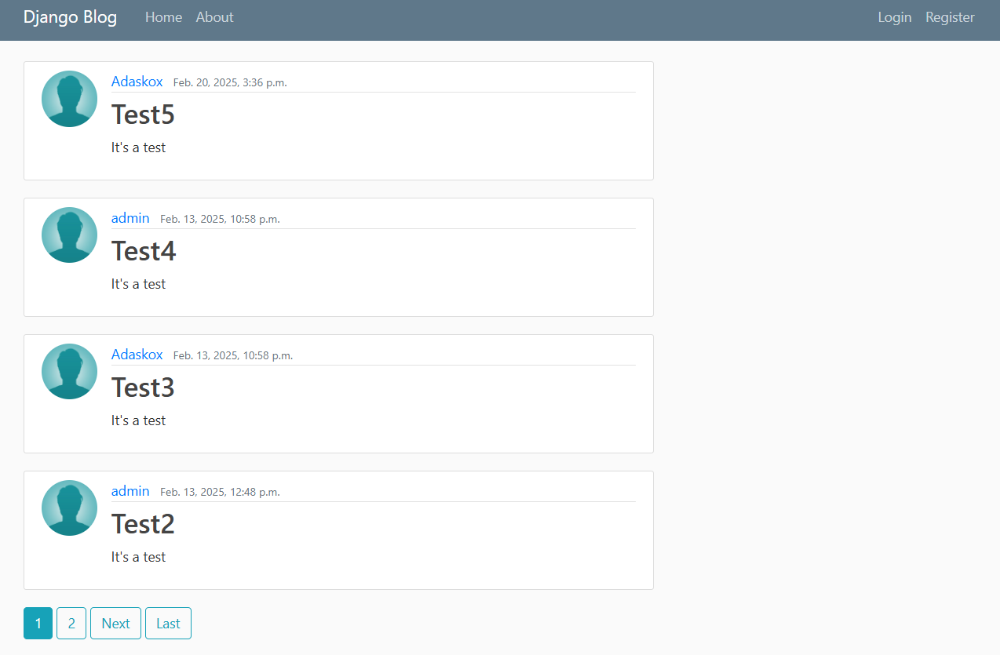

# Django_Blog
<h1>A simple Django Blog:</h1>

## Description

This repository is a Django application that enables the user to:

- Create a profile 
- Login/Register to portal
- Update account data, change avatars
- Add, edit and remove posts
- Utilize REST API for all interactions with the application.

### Technologies Used:

- **Python==3.13**
- **Django==5.1.6**
- **djangorestframework==3.15.2** - Provides tools for building REST APIs  
- **django-crispy-forms==2.3** - Enhances form rendering, making them more flexible  
- **crispy-bootstrap4==2024.10** - Bootstrap 4 support for django-crispy-forms  
- **django-extensions==3.2.3** - Adds extra management commands for Django projects  
- **drf-yasg==1.21.8** - Generates interactive API documentation (Swagger/OpenAPI)  
- **Jinja2==3.1.5** - A templating engine, useful if using Jinja with Django  
- **MarkupSafe==3.0.2** - Ensures safe rendering of HTML (used by Jinja2)  
- **pillow==11.1.0** - Image processing library (used for handling images in Django)  
- **PyYAML==6.0.2** - Parses YAML files, useful for configuration  
- **requests==2.32.3** - Simplifies making HTTP requests  
- **sqlparse==0.5.3** - SQL parser, used internally by Django  

### How to run locally:

1. Clone the repo

    git clone https://github.com/Aylift/Django_Blog.git
   
    cd Django_Blog

2. Install requirements
 
    _pip install -r requirements.txt_

3. Run Server

    - `cd blog_project`
    - `python manage.py runserver`

4. Open localhost in your browser

    _http://localhost:8000_

## Documentation

For detailed documentation, visit [Django Blog App Documentation](https://Aylift.github.io/Django_Blog/).